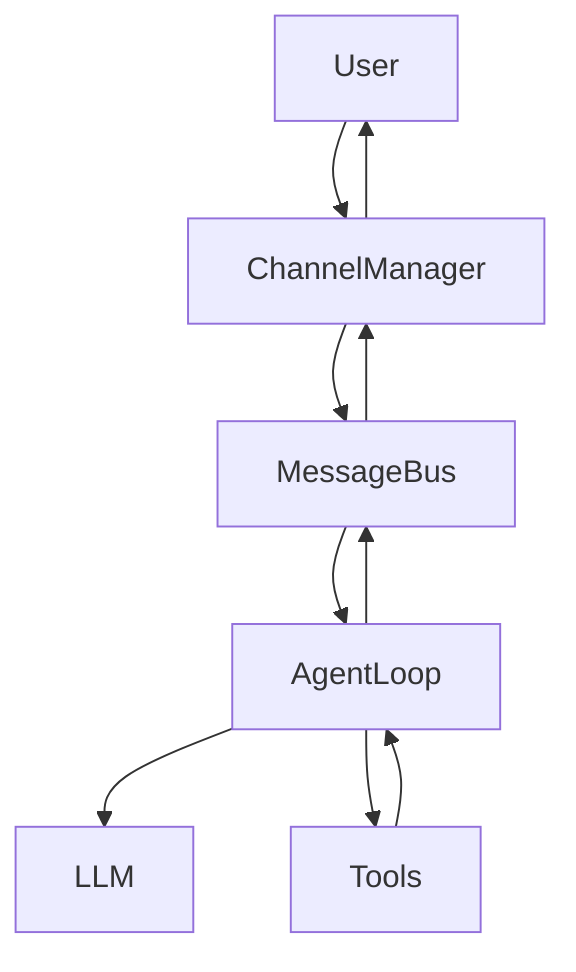

# nanobot Architecture (Simplified)

nanobot is a lightweight, event-driven AI agent framework.

## Core Flow

1. **Channels**: Receive messages from Telegram, Discord, etc.
2. **Message Bus**: Routes inbound messages to the Agent Loop.
3. **Agent Loop**:
    - Assembles context (prompts, history, memory).
    - Calls LLM (via LiteLLM).
    - Executes tools in parallel.
    - Sends response back to the bus.
4. **Output**: Channels deliver the response to the user.

## Messaging Architecture

## Memory System (KISS)

nanobot uses a simple, file-based memory system:
- `MEMORY.md`: Long-term facts and preferences.
- `HISTORY.md`: Grep-searchable conversation log.
- `FAILURES.md`: Failure log for self-improvement.

## Logging

Structured logs are saved to `~/.nanobot/logs/nanobot.jsonl`. This format is optimized for automated analysis and monitoring.
